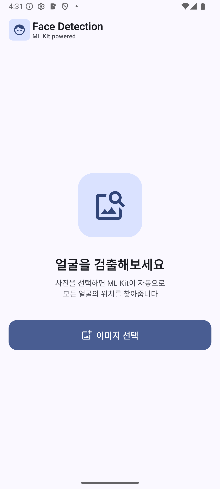
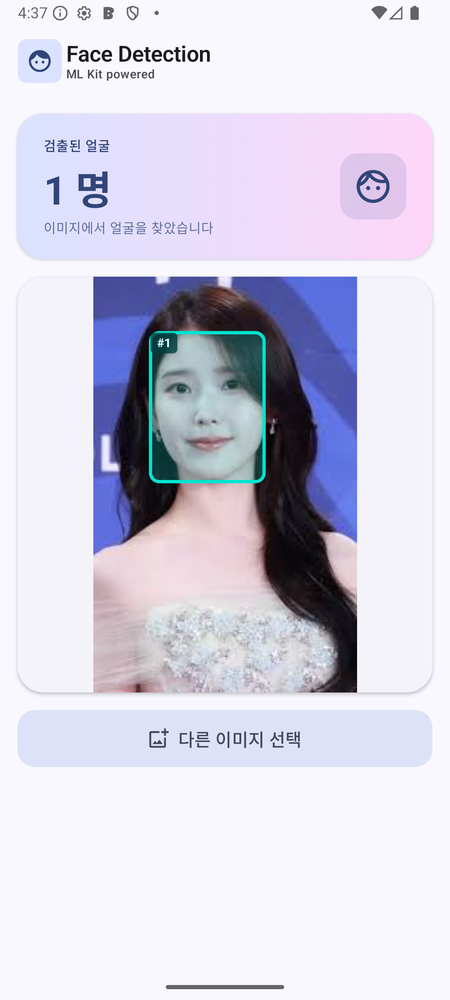
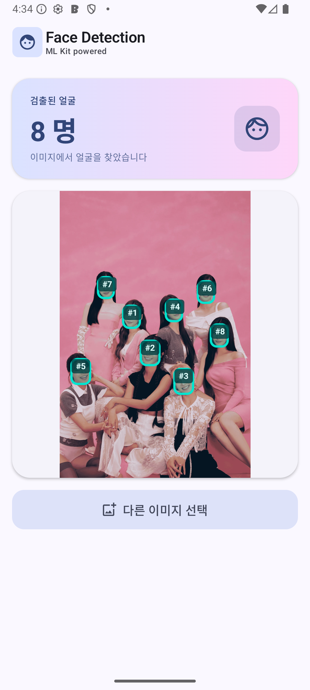

# ML Kit Face Count

Google ML Kit Face Detection을 사용하여 이미지 속 얼굴을 검출하고, 얼굴 수와 bounding box를 표시하는 Android 샘플 앱입니다.

## Screenshots

<p align="center">
  
  
  
</p>

<p align="center">
  <em>초기 화면 &nbsp;&nbsp;&nbsp;&nbsp;&nbsp;&nbsp;&nbsp;&nbsp;&nbsp;&nbsp;&nbsp;&nbsp;&nbsp;&nbsp;&nbsp;&nbsp;&nbsp;&nbsp;&nbsp;&nbsp;&nbsp;&nbsp;&nbsp;&nbsp;&nbsp; 1인 검출 결과 &nbsp;&nbsp;&nbsp;&nbsp;&nbsp;&nbsp;&nbsp;&nbsp;&nbsp;&nbsp;&nbsp;&nbsp;&nbsp;&nbsp;&nbsp;&nbsp;&nbsp;&nbsp;&nbsp;&nbsp;&nbsp;&nbsp;&nbsp;&nbsp;&nbsp; 8명 단체 사진 검출</em>
</p>

## Features

- **이미지 선택**: 시스템 Photo Picker로 갤러리에서 이미지 선택 (권한 불필요)
- **얼굴 검출**: ML Kit `PERFORMANCE_MODE_ACCURATE`로 정확한 얼굴 검출
- **Bounding Box 오버레이**: 검출된 각 얼굴에 번호 칩 + 반투명 박스 표시
- **좌표계 변환**: 원본 이미지 좌표 → 화면 표시 좌표 자동 매핑
- **에러 처리**: 이미지 로드 실패 / 검출 실패 시 에러 UI 표시

## Tech Stack

| 기술 | 용도 |
|---|---|
| Kotlin | 언어 |
| Jetpack Compose | UI |
| Material 3 | 디자인 시스템 |
| ML Kit Face Detection | 얼굴 검출 엔진 |
| Coil | 비동기 이미지 로딩 |
| ViewModel + StateFlow | MVVM 상태 관리 |

## Architecture

```
MainActivity
  └─ FaceDetectionScreen (Composable)
       ├─ FaceDetectionViewModel (AndroidViewModel)
       │    ├─ ML Kit FaceDetector
       │    └─ StateFlow<FaceDetectionUiState>
       └─ ImageWithFaceOverlay (Composable)
            ├─ AsyncImage (Coil)
            └─ Canvas (bounding box overlay)
```

### 주요 파일

| 파일 | 역할 |
|---|---|
| `FaceDetectionUiState.kt` | UI 상태 data class |
| `FaceDetectionViewModel.kt` | ML Kit 얼굴 검출 로직 + 상태 관리 |
| `FaceDetectionScreen.kt` | 메인 화면 (이미지 선택, 결과 표시, 상태 전환 애니메이션) |
| `FaceOverlay.kt` | 이미지 위 bounding box + 번호 칩 오버레이 |
| `ui/theme/` | Material 3 테마 (Color, Shape, Typography) |

## Bounding Box 좌표 변환

ML Kit은 **원본 이미지 픽셀 좌표**로 bounding box를 반환하지만, 화면에는 `ContentScale.Fit`으로 축소 표시됩니다.

```
scale = min(displayWidth / imageWidth, displayHeight / imageHeight)
offsetX = (displayWidth - imageWidth * scale) / 2
offsetY = (displayHeight - imageHeight * scale) / 2

화면 좌표 = 원본 좌표 × scale + offset
```

## PERFORMANCE_MODE 비교

| | FAST | ACCURATE |
|---|---|---|
| 속도 | 빠름 (실시간 가능) | 느림 |
| 정확도 | 정면/큰 얼굴 위주 | 측면/작은 얼굴도 검출 |
| 용도 | 카메라 프리뷰 | 정적 이미지 분석 |

이 앱은 정적 이미지 분석이므로 `ACCURATE` 모드를 사용합니다.

## Requirements

- Android Studio Meerkat 이상
- minSdk 31 / targetSdk 36
- 에뮬레이터 또는 실기기

## Getting Started

```bash
git clone https://github.com/RYUDAYUN/mlkit-face-count.git
```

1. Android Studio에서 프로젝트 열기
2. Gradle Sync 실행
3. 에뮬레이터(API 31+) 또는 실기기에서 Run
4. "이미지 선택" 버튼으로 갤러리에서 사진 선택

## License

This project is for educational purposes.
